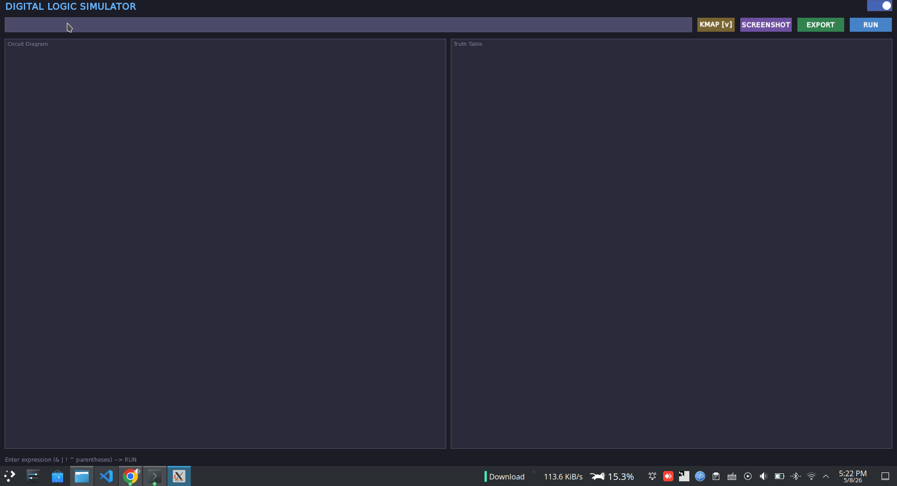
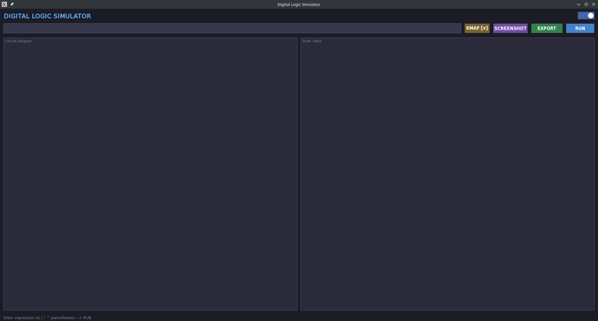
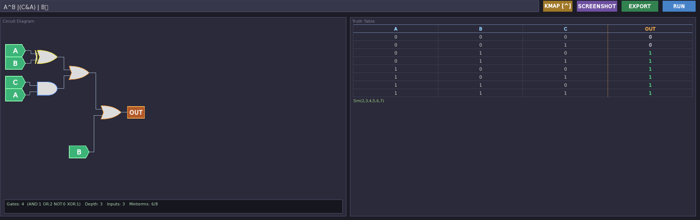
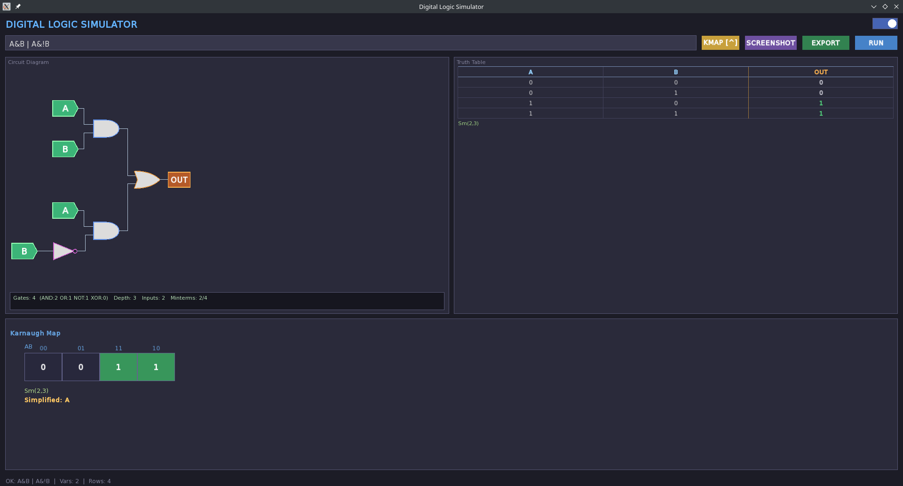
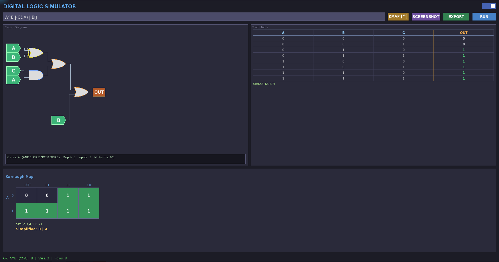
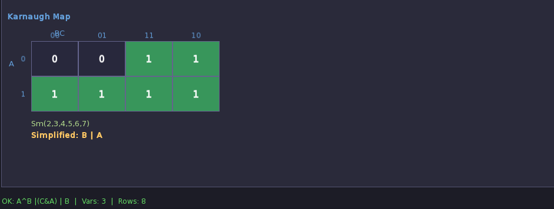

# Digital Logic Simulator

A desktop app that takes any boolean expression and instantly shows you the circuit diagram, truth table, K-Map, and the simplified SOP expression — all in real time. No browser, no online tools, runs fully offline.

Built from scratch in C++17 with SFML.



---

## What it does

You type something like `A^B | (C&A) | B` and hit Run. It gives you:

- **Circuit Diagram** — draws the actual logic gates (AND, OR, NOT, XOR) wired together automatically
- **Truth Table** — generates all input combinations with outputs, highlights the row you click
- **Karnaugh Map** — 2, 3, or 4 variable K-Map drawn automatically
- **Simplified Expression** — runs Quine-McCluskey on the minterms and gives you the minimal SOP form
- **Gate Stats** — gate count, circuit depth, input count, minterm ratio at a glance
- **Screenshot** — saves the circuit as a PNG
- **Export** — exports the truth table and expression to a `.txt` file
- **Dark/Light mode** toggle

---

## Screenshots

**Clean interface on launch**



**Circuit diagram + truth table**



**Full simulation with K-Map and simplified expression**





**Karnaugh Map with Quine-McCluskey result**



---

## Tech stack

- **C++17**
- **SFML 2.6** — window, rendering, fonts
- **Quine-McCluskey algorithm** — written from scratch for SOP minimization
- **Recursive descent parser** — tokenizes and parses boolean expressions into an AST
- **Custom circuit layout engine** — places gates and wires automatically based on tree depth and leaf count

---

## Supported operators

| Symbol | Meaning  |
|--------|----------|
| `&`    | AND      |
| `\|`   | OR       |
| `^`    | XOR      |
| `!`    | NOT      |
| `( )`  | Grouping |

Variables can be any uppercase letter: `A`, `B`, `C`, `D`.

---

## Build & Run

**Requirements**
- g++ with C++17 support
- SFML 2.6 dev libraries

**Install SFML (Ubuntu/Kubuntu)**
```bash
sudo apt install libsfml-dev
```

**Compile**
```bash
g++ -std=c++17 main.cpp GUI.cpp Parser.cpp Tokenizer.cpp TruthTable.cpp CircuitDrawer.cpp KMapDrawer.cpp \
$(pkg-config --cflags --libs sfml-graphics sfml-window sfml-system) \
-o logic_sim
```

**Run**
```bash
./logic_sim
```

Make sure the `assets/fonts/` folder is in the same directory as the binary.

---

## Project structure

```
├── main.cpp              entry point
├── GUI.cpp / .h          main window, layout, event handling
├── Parser.cpp / .h       recursive descent boolean expression parser
├── Tokenizer.cpp / .h    splits raw string into tokens
├── Node.h                AST node types (AndGate, OrGate, NotGate, XorGate, InputNode)
├── TruthTable.cpp / .h   truth table generation + Quine-McCluskey simplifier
├── CircuitDrawer.cpp / .h  automatic gate placement and wire routing
├── KMapDrawer.cpp / .h   Karnaugh map renderer (2-4 variables)
└── assets/fonts/         font files
```

---

## Expressions to try

```
A & B
A | !B
A^B | (C&A) | B
(A & B) | (B & C)
A&B | A&!B
(A&B^B&C) ^C^A
```

---

## About

Digital Logic Simulator - An OOP lab project developed in Level 1, Semester 2 at KUET CSE, featuring simulation of fundamental digital logic gates and circuits through an interactive and user-friendly interface.

~ Turjo

GitHub: [turjo-deb](https://github.com/turjo-deb)

---

## License

MIT — do whatever you want with it.
